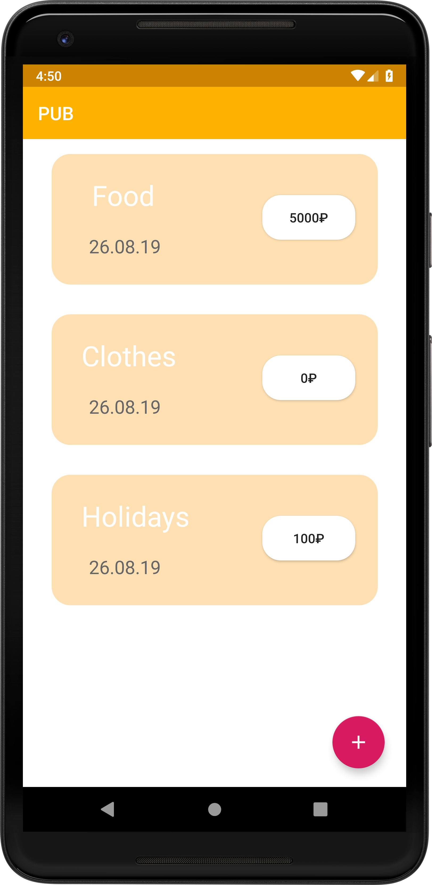

# PUB

My first android app that helps you to plan a budget or not

## Screenshots
    

## Libraries Used
- [Dagger 2](https://github.com/google/dagger) - A fast dependency injector for Android and Java
- [Butterknife](https://github.com/JakeWharton/butterknife) - View "injection" library for Android
- [Moxy](https://github.com/Arello-Mobile/Moxy) - MVP library for Android
- [Room](https://developer.android.com/jetpack/androidx/releases/room) - The library provides an abstraction layer over SQLite
- [PhotoView](https://github.com/chrisbanes/PhotoView) - Implementation of ImageView for Android that supports zooming, by various touch gestures.

